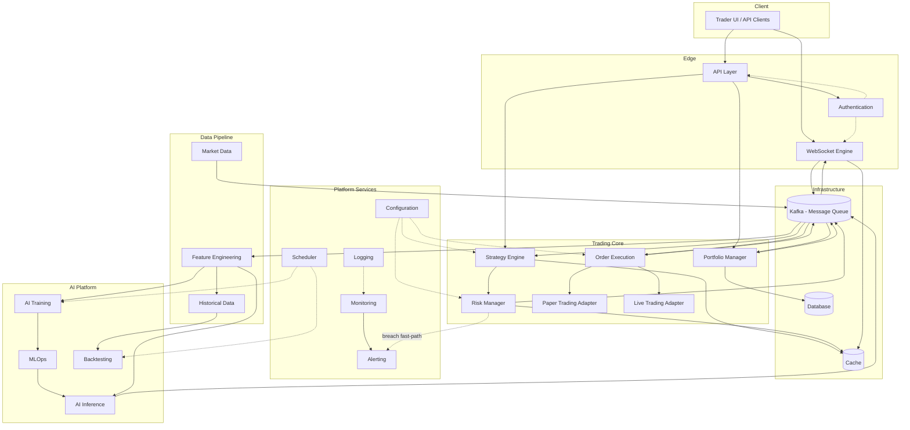
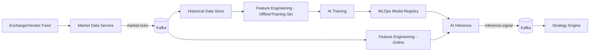
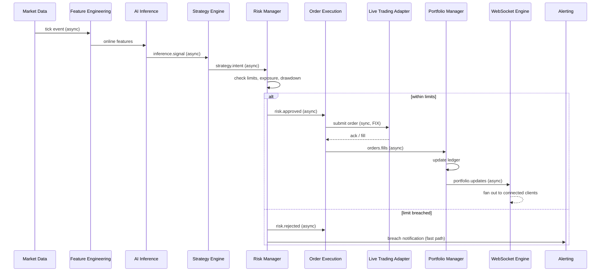
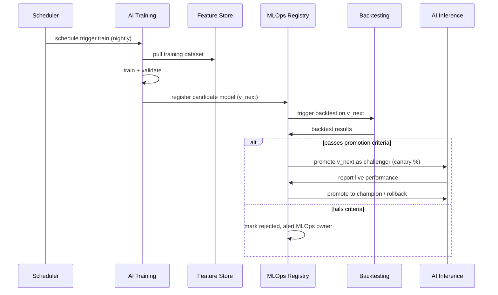
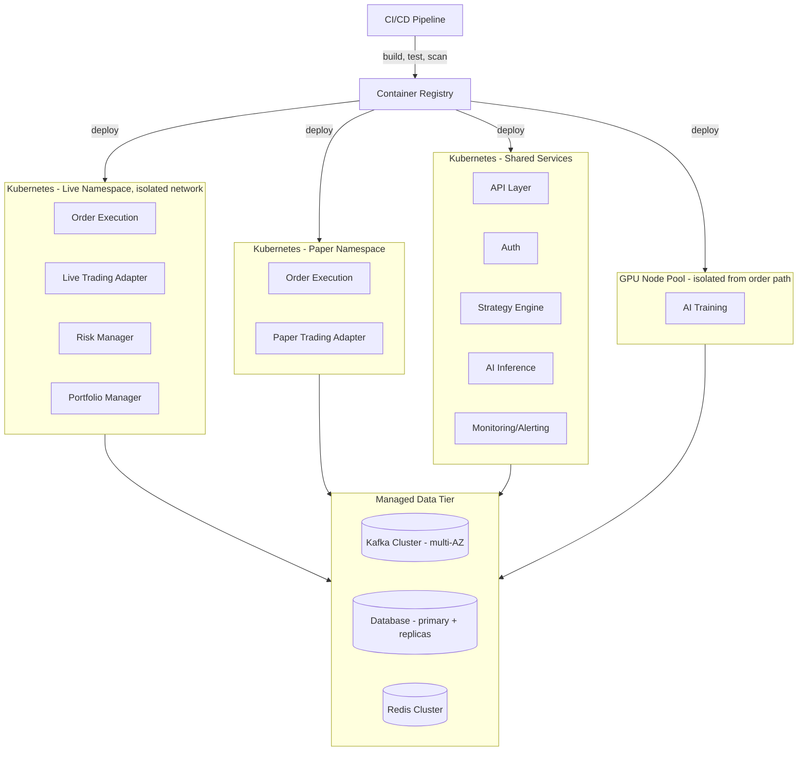

# Institutional-Grade AI Trading Platform
## Phase 1 — System Architecture Document

**Status:** Draft for approval — implementation code intentionally excluded per Phase 1 scope.

---

## 1. Chosen Architecture

**Event-Driven, Domain-Oriented Microservices (EDMA)** — each domain module is an independently deployable service, internally structured as **Hexagonal (Ports & Adapters)**, communicating primarily through an **event backbone (Kafka)** with synchronous **gRPC/REST** reserved for request/response paths (auth, order placement ack, queries). **CQRS** is applied specifically to the Market Data / Order State boundary, separating the high-throughput write path (tick ingestion, fills) from the read path (dashboards, portfolio queries).

This is not "microservices for the sake of it" — it is a deliberate choice driven by the two things that dominate a trading system's risk profile: **throughput/latency under bursty load** and **auditability under regulatory scrutiny**. Every other structural decision in this document follows from those two constraints.

---

## 2. Why EDMA Beats Monolithic, MVC, and Plain Microservices Here

| Concern | Monolithic | MVC (classic 3-tier) | Plain Microservices (REST, sync) | **EDMA (chosen)** |
|---|---|---|---|---|
| Market data burst handling | Single process chokes; GC pauses stall order flow | Same — request/response model not built for streams | Sync REST between services creates cascading backpressure | Kafka partitions absorb bursts; consumers scale independently |
| AI training vs. live trading isolation | Training job competes for the same CPU/memory as the order path | Same coupling problem | Training service can still block execution service via sync calls under load | Training runs fully decoupled; only publishes model artifacts, never blocks execution |
| Audit trail / regulatory replay | Must be bolted on; hard to reconstruct exact causal order | Same | Partial — logs scattered across services with no single ordered log | Kafka topics ARE the audit log — immutable, ordered, replayable by design |
| Independent scaling | Impossible — scale everything or nothing | Impossible | Possible but each sync call is a new failure/latency point | Each service scales on its own metric (WS Engine on connections, Inference on GPU queue depth) |
| Blast radius of a bug | Entire platform restarts | Entire platform restarts | Limited to callers of the failing service (still significant if sync) | Limited to consumers of one topic; others keep running on last-known state |
| Deployment risk for AI model updates | Full redeploy needed to swap a model | Full redeploy | Redeploy one service, but sync callers still see downtime during rollout | Blue/green model swap behind the Inference service; zero order-flow disruption |
| Fit for "new feature = new consumer" growth | Poor — every change ripples through shared code | Poor — same reason | Fair, but you're adding fragile sync chains | Strong — new consumer just subscribes to existing topics, nothing upstream changes |

**Against Monolithic:** A trading platform has wildly different scaling and criticality profiles per module (WebSocket fan-out vs. nightly training vs. sub-100ms order execution). A monolith forces them to share fate — a memory leak in a backtesting job should never be able to delay a live order.

**Against classic MVC:** MVC assumes a single request/response web app shape. Trading is fundamentally stream-first (ticks, fills, signals arrive continuously, not on request), so MVC's Model-View-Controller framing doesn't map cleanly onto anything except the operator dashboard (which *is* built as a thin MVC-style app on top of the read side — see §3.1).

**Against plain synchronous microservices:** Splitting into services without an event backbone just relocates the monolith's coupling problem onto the network, and adds the worst property for trading: synchronous calls between Strategy → Risk → Execution mean the slowest service sets the latency floor for every order, and a temporary Risk Manager blip can silently stall Execution instead of failing loudly.

**Trade-offs we accept:** EDMA is operationally heavier (you now run/monitor a broker cluster, need schema governance on events, and eventual consistency needs to be reasoned about explicitly). We accept this because in a trading system, "slightly harder ops" is a much smaller risk than "unauditable state" or "coupled failure domains."

---

## 3. Module Design

Each module below: **Responsibility → Primary interface → Talks to → Data owned**.

### 3.1 API Layer (Edge / BFF)
- Responsibility: single entry point for UI/operator clients and external partner integrations; request validation, rate limiting, response shaping.
- Interface: REST + GraphQL for queries (read side of CQRS), thin MVC-style controllers here are appropriate since this is the one genuinely request/response-shaped module.
- Talks to: Authentication (verify token), Portfolio Manager (read), Strategy Engine (config), Order Execution (command, via async ack pattern), Cache (read-through).
- Owns: no business data — stateless.

### 3.2 Authentication & Authorization
- Responsibility: identity, session/token issuance (OAuth2/OIDC + short-lived JWT), RBAC/ABAC for trader/risk-officer/admin roles, MFA for live-trading actions.
- Interface: gRPC internal, REST external.
- Talks to: API Layer (every request), Audit/Logging (every auth decision logged), Config (policy definitions).
- Owns: user identities, roles, permission policies (its own datastore — never shared).

### 3.3 Configuration Service
- Responsibility: centralized, versioned config (strategy parameters, risk limits, symbol universes, feature flags) with environment overlays (dev/paper/live).
- Interface: gRPC/REST pull + push notification on change (event: `config.updated`).
- Talks to: nearly every service (pulled at boot, subscribed for hot-reload); Risk Manager and Strategy Engine specifically subscribe to `config.updated` to react to limit changes without redeploy.
- Owns: config store (e.g., etcd/Consul), full change history for audit.

### 3.4 Logging Service
- Responsibility: structured, correlation-ID-tagged log aggregation from all services.
- Interface: log shipping agent (sidecar) → central pipeline (e.g., Fluent Bit → Kafka topic `logs.*` → sink to Elasticsearch/Loki).
- Talks to: every service (write-only, fire-and-forget); Monitoring/Alerting reads from the same sink.
- Owns: log storage with retention tiers (hot/warm/cold) sized for regulatory retention requirements.

### 3.5 Market Data Service
- Responsibility: ingest real-time quotes/trades from exchange/vendor feeds, normalize, publish.
- Interface: consumes vendor protocols (FIX/proprietary), publishes to Kafka topic `market.ticks.<symbol>`.
- Talks to: WebSocket Engine (fan-out source), Feature Engineering, Strategy Engine, Historical Data (persist-on-write).
- Owns: nothing long-term — it's a pass-through/normalization layer; Historical Data owns storage.

### 3.6 WebSocket Engine
- Responsibility: maintain client connections, fan out live ticks/portfolio updates/order fills to UI and algo clients at low latency.
- Interface: WebSocket (client-facing), Kafka consumer (internal — subscribes to `market.ticks.*`, `orders.fills`, `portfolio.updates`).
- Talks to: Market Data, Order Execution, Portfolio Manager (all as upstream event sources); Authentication (connection-time token validation).
- Owns: connection state only (in-memory + Cache for reconnect/session resume).

### 3.7 Historical Data Service
- Responsibility: durable, queryable store of OHLCV and tick-level history; corporate actions adjustment.
- Interface: gRPC query API; consumes `market.ticks.*` for continuous persistence.
- Talks to: Feature Engineering, AI Training, Backtesting (all heavy read consumers).
- Owns: time-series database (e.g., a columnar/timeseries store), partitioned by symbol/date.

### 3.8 Feature Engineering Service
- Responsibility: compute technical indicators, statistical features, and derived signals from raw/historical data; maintain feature parity between training and inference (critical — this is the #1 source of train/serve skew bugs).
- Interface: gRPC (on-demand for inference), batch jobs (for training sets); shares a single feature-definition library used by both paths.
- Talks to: Historical Data, Market Data (streaming features), AI Training, AI Inference.
- Owns: a Feature Store (offline table for training + online low-latency store for inference).

### 3.9 AI Training Service
- Responsibility: scheduled/triggered model training, hyperparameter search, validation against holdout data.
- Interface: job-queue triggered (Scheduler), writes model artifacts + metrics.
- Talks to: Feature Engineering (training set), MLOps (registers artifact), Historical Data.
- Owns: training job state, experiment metadata (or delegates to MLOps' experiment tracker).
- **Isolation guarantee:** runs on separate compute pool (GPU nodes), never shares a node or process with anything on the order-execution path.

### 3.10 AI Inference Service
- Responsibility: serve model predictions with strict latency SLA; supports champion/challenger and canary model versions.
- Interface: gRPC, low-latency; pulls features from the Feature Store's online layer.
- Talks to: Feature Engineering (online features), MLOps (model version to load), Strategy Engine (publishes `inference.signal` events).
- Owns: loaded model artifacts (read-only cache from MLOps registry).

### 3.11 Strategy Engine
- Responsibility: combine AI signals + rule-based logic into concrete trade intents; strategy versioning; supports multiple concurrent strategies.
- Interface: consumes `inference.signal`, `market.ticks.*`; publishes `strategy.intent`.
- Talks to: AI Inference, Risk Manager (every intent must clear risk before becoming an order), Configuration.
- Owns: strategy definitions/state machines.

### 3.12 Risk Manager
- Responsibility: pre-trade checks (position limits, exposure, drawdown, circuit breakers), post-trade monitoring, kill-switch authority.
- Interface: consumes `strategy.intent`, publishes `risk.approved` / `risk.rejected` (synchronous-feeling but implemented as a fast in-memory gate to keep latency low — this is the one place where sub-millisecond event round-trip matters most).
- Talks to: Portfolio Manager (current exposure), Configuration (limits), Order Execution (gate before submission), Alerting (immediate on breach).
- Owns: real-time risk-state cache (independent from Portfolio Manager's ledger to avoid a single point of failure controlling both exposure truth and the gate).

### 3.13 Portfolio Manager
- Responsibility: maintain authoritative positions, P&L, exposure, cash balances across paper and live accounts.
- Interface: consumes `orders.fills`; publishes `portfolio.updates`; gRPC query API for reads.
- Talks to: Order Execution (fills), Risk Manager (exposure snapshots), API Layer (read queries), Database.
- Owns: the ledger — single source of truth for positions.

### 3.14 Order Execution Service
- Responsibility: translate approved risk-cleared orders into exchange/broker order messages (FIX or broker API), manage order lifecycle (new/partial/filled/cancelled/rejected).
- Interface: consumes `risk.approved`; publishes `orders.fills`, `orders.status`.
- Talks to: Risk Manager (gate), Paper Trading or Live Trading adapter (chosen by mode flag from Configuration), Portfolio Manager.
- Owns: order state machine, exchange session management.

### 3.15 Paper Trading Adapter
- Responsibility: simulate fills against live market data with realistic slippage/latency models, without touching a real venue.
- Interface: implements the same port/interface as the Live Trading adapter (Hexagonal — Order Execution is unaware which one is plugged in).
- Talks to: Market Data (for simulated fill pricing), Order Execution.

### 3.16 Live Trading Adapter
- Responsibility: real venue connectivity (FIX gateway/broker API), real order routing.
- Interface: same port as Paper Trading — this symmetry is what lets a strategy graduate from paper to live with zero code change, only a config flip.
- Talks to: exchange/broker, Order Execution.

### 3.17 Backtesting Service
- Responsibility: replay historical data + a given strategy/model version to evaluate performance before paper/live promotion.
- Interface: batch job (Scheduler-triggered or on-demand), reuses the exact Strategy Engine and Risk Manager logic (packaged as a library invoked in "replay mode") to avoid backtest/live logic divergence.
- Talks to: Historical Data, Feature Engineering, MLOps (records backtest results against a model version).

### 3.18 Database (Operational Store)
- Responsibility: durable OLTP storage for orders, positions, accounts, audit trail.
- Interface: standard driver access, one schema per owning service (no shared tables across service boundaries — a core microservices rule).
- Talks to: Portfolio Manager, Order Execution, Authentication (each with its own logical/physical isolation).

### 3.19 Cache
- Responsibility: low-latency shared state — session tokens, latest quote snapshots, risk-limit lookups, WebSocket reconnect buffers.
- Interface: Redis (or equivalent), read-through/write-through per consumer.
- Talks to: nearly every service as an optimization layer — never the system of record.

### 3.20 Message Queue / Event Backbone
- Responsibility: the nervous system of the platform — Kafka (or Pulsar) cluster carrying all domain events with ordering guarantees per partition key (symbol, order ID).
- Interface: topics as the contract; schema registry enforces backward-compatible event schemas.
- Talks to: every service, as producer and/or consumer.

### 3.21 Monitoring
- Responsibility: metrics collection (latency, throughput, error rates, model drift, risk-limit utilization) — Prometheus/Grafana style.
- Interface: pull (metrics endpoints) + push (for batch jobs).
- Talks to: every service exposes metrics; Alerting consumes Monitoring's evaluated rules.

### 3.22 Alerting
- Responsibility: turn monitoring rules/risk breaches/system faults into paged notifications (PagerDuty/Slack/SMS), with severity routing.
- Interface: consumes Monitoring rule evaluations and direct `risk.rejected`/breach events for the fastest path (bypassing the metrics pipeline for latency-critical alerts).
- Talks to: Monitoring, Risk Manager (direct fast path), on-call tooling.

### 3.23 Scheduler
- Responsibility: cron-like and event-triggered orchestration — nightly training, EOD reconciliation, periodic backtests, feature-store refresh.
- Interface: triggers jobs via the Message Queue (`schedule.trigger.*` events) rather than calling services directly, keeping it decoupled.
- Talks to: AI Training, Backtesting, Historical Data (batch jobs), MLOps.

### 3.24 MLOps
- Responsibility: model registry, experiment tracking, versioning, champion/challenger promotion workflow, drift detection, automated rollback.
- Interface: registry API (used by Training to push, Inference to pull); drift alerts feed Alerting.
- Talks to: AI Training, AI Inference, Backtesting (gate promotion on backtest results), Monitoring (drift signals).

### 3.25 DevOps / Platform
- Responsibility: CI/CD pipelines, container orchestration (Kubernetes), infrastructure-as-code, secrets management, environment provisioning (dev/paper/live are separate clusters or namespaces with hard network boundaries).
- Interface: not a runtime service — a supporting discipline/toolchain (see §15).

---

## 4. Communication Summary

- **Asynchronous, event-driven (Kafka)** — default for anything on the market-data-to-order path: `market.ticks.*`, `inference.signal`, `strategy.intent`, `risk.approved/rejected`, `orders.fills`, `portfolio.updates`, `config.updated`. This is the majority of inter-service traffic.
- **Synchronous (gRPC)** — used only where a true request/response is needed and low volume: Authentication checks, Configuration pulls at boot, Feature Store online lookups (latency-critical but not event-shaped), Historical Data / Portfolio queries from the API Layer.
- **REST/GraphQL** — external-facing only, at the API Layer.

---

## 5. Dependency Flow

Dependency direction flows from **domain core → infrastructure**, never the reverse (Hexagonal principle applied per service):

```
Strategy Engine, Risk Manager, Portfolio Manager   (domain/business logic — pure, testable)
        │ depends on interfaces (ports) only
        ▼
Adapters (Kafka producer/consumer, DB repository, exchange gateway)
        │
        ▼
Infrastructure (Kafka cluster, Database, Cache, exchange connectivity)
```

At the service-graph level, dependency flow is intentionally acyclic:

```
Config/Auth (foundational — everyone depends on these)
        │
Market Data → Feature Engineering → AI Training → MLOps → AI Inference
        │                                                      │
        ▼                                                      ▼
 Historical Data ← Backtesting                          Strategy Engine
                                                                │
                                                                ▼
                                                          Risk Manager
                                                                │
                                                                ▼
                                                        Order Execution → Paper/Live Adapter
                                                                │
                                                                ▼
                                                        Portfolio Manager → API Layer / WebSocket Engine
```

No downstream service (e.g., Order Execution) is ever depended upon by an upstream one (e.g., Market Data) — this prevents circular coupling and lets you deploy the pipeline stage-by-stage.

---

## 6. Event Flow (Happy Path — Signal to Fill)

```
1. Market Data publishes market.ticks.AAPL
2. Feature Engineering (streaming) updates online features
3. AI Inference computes prediction → publishes inference.signal
4. Strategy Engine evaluates signal + rules → publishes strategy.intent
5. Risk Manager gates intent against limits → publishes risk.approved
6. Order Execution submits order via Live/Paper adapter
7. Adapter returns fill → Order Execution publishes orders.fills
8. Portfolio Manager updates ledger → publishes portfolio.updates
9. WebSocket Engine fans out orders.fills + portfolio.updates to connected clients
10. Logging/Monitoring observe every step via correlation ID threading the whole chain
```

Every event carries a `correlation_id` generated at step 1 so the entire causal chain is reconstructable for audit — this is the direct payoff of choosing an event-sourced backbone over synchronous calls.

---

## 7. Mermaid Architecture Diagrams

### 7.1 High-Level Component Diagram



### 7.2 Data Flow — Market Data to AI Signal



---

## 8. Sequence Diagrams

### 8.1 Live Order Placement (Signal → Fill)



### 8.2 Model Training → Promotion → Inference



---

## 9. Scalability

- **Horizontal by domain, not uniformly:** WebSocket Engine scales on concurrent connections; AI Inference scales on GPU/queue depth; Order Execution scales conservatively (favor fewer, larger, well-monitored instances since order sequencing matters).
- **Kafka partitioning by symbol/account** allows near-linear throughput scaling for market data and order flow while preserving per-key ordering.
- **CQRS read replicas:** Portfolio/Historical read paths scale independently of the write path via read replicas / materialized views, so a dashboard-heavy day never competes with order flow for DB capacity.
- **Stateless edge (API Layer, Auth)** scales trivially behind a load balancer.

## 10. Fault Tolerance

- Kafka consumer groups + offset commits mean a crashed service resumes exactly where it left off — no event loss.
- Circuit breakers on all synchronous calls (e.g., Feature Store online lookup) with sane fallbacks (last-known feature value, flagged as stale).
- Risk Manager defaults to **reject on uncertainty** (fail-closed) — if it cannot confirm current exposure, it blocks new orders rather than guessing.
- Idempotent consumers everywhere (dedup by event ID) to tolerate at-least-once delivery semantics from Kafka.

## 11. High Availability

- Every stateful infra component (Kafka, DB, Cache) runs as a replicated cluster across at least 3 availability zones.
- Order Execution and Risk Manager run active-active with sticky-partition routing so a node failure doesn't drop in-flight orders; the Live Trading Adapter's session state is externalized to Cache so a failover node can resume the exchange session.
- Health checks + automatic pod rescheduling (Kubernetes) for all services; readiness probes prevent traffic routing to services still replaying state.

## 12. Disaster Recovery

- Cross-region async replication of Database and Kafka (MirrorMaker or equivalent) with a defined RPO/RTO per module — tightest for Portfolio/Order state, looser for Historical Data/Training artifacts.
- Full environment-as-code (DevOps §15) means a second region can be stood up from IaC + latest snapshots without manual reconstruction.
- Regular DR drills: fail over Paper Trading environment first as a rehearsal before any live-environment failover exercise.
- Immutable event log (Kafka retention + cold storage archive) means post-incident state can always be rebuilt by replay, independent of DB snapshot recency.

## 13. Security Architecture

- **Perimeter:** API Layer behind WAF + rate limiting; mTLS between all internal services (service mesh).
- **AuthN/AuthZ:** OIDC-based identity, short-lived JWTs, RBAC/ABAC with a hard separation between "view" and "trade" and "admin/risk-override" permission tiers; MFA mandatory for any live-trading-affecting action.
- **Secrets:** centralized secrets manager (e.g., Vault) — no credentials in config files or images; exchange API keys rotated on schedule.
- **Network segmentation:** live-trading namespace is network-isolated from paper/dev; only Order Execution + Live Trading Adapter can reach real exchange endpoints.
- **Audit:** every risk decision, order, and config change is an immutable, signed event — satisfies institutional audit/compliance requirements out of the box.
- **Data protection:** encryption at rest and in transit everywhere; PII (if any, e.g., account holder info) isolated to Authentication's own store, never replicated into analytics/training data paths.

## 14. AI Lifecycle

```
Data (Historical + streaming) 
  → Feature Engineering (shared offline/online definitions)
  → Training (scheduled or triggered)
  → Registry (versioned, immutable artifacts + lineage: which data, which code, which hyperparams)
  → Backtesting (gate before any promotion)
  → Canary/Challenger in Inference (shadow or small-% live traffic)
  → Promotion to Champion (criteria-based, human-approved for live-trading models)
  → Continuous drift/performance monitoring
  → Automatic rollback to previous champion on drift/degradation
  → Retraining trigger (scheduled or drift-triggered) — loop closes
```

Key discipline: **the same Feature Engineering code path serves both training and inference** — this single decision eliminates the most common and dangerous class of quant-system bugs (train/serve skew).

## 15. Deployment Architecture



- **CI/CD (DevOps):** every commit → automated tests + backtest regression suite → staged rollout (dev → paper → live), with live-namespace deploys requiring manual approval gate regardless of pipeline pass status.
- **Environment isolation:** dev/paper/live are physically or namespace-isolated Kubernetes clusters with independent Kafka topics/DB schemas — a bug in paper trading configuration cannot leak into live.
- **Infrastructure as Code:** all of the above defined declaratively (Terraform/Helm) for reproducibility and DR.

---

## Deliverables Summary (this document)

- ✅ Architecture document (this file)
- ✅ Mermaid diagrams (component, data flow, deployment)
- ✅ Sequence diagrams (order flow, AI lifecycle)
- ✅ Design decisions & justification vs. alternatives
- ✅ Advantages / trade-offs (§2, §9–§13)

---

**Phase 1 complete. Awaiting your review and approval before Phase 2.**
